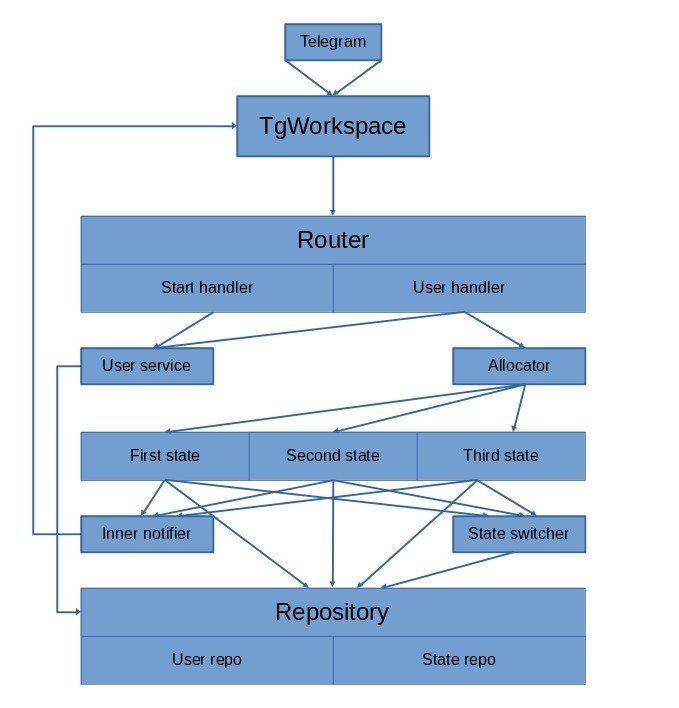

# Description

Go application with telegram bot. Consider it like test example.

Target fsm model of user:

1) First state

    a) to second state

2) Second state

    a) to first state

    b) to third state

3) Third state

    a) to first state

    b) show joke


# Content

* [Architecture](#architecture)
* [Realized concept](#realized-concept)
* [Run project](#run-project)
* [Recommendations](#recommendations)

# Architecture
Project has next architecture:
<p align="center">

</p>

# Realized concept
Created fsm model with 3 states:
1) First state

    a) to second state

2) Second state

    a) to first state

    b) to third state

3) Third state

    a) to first state

    b) show joke

# Recommendations
Use not default password for database in environment configuration for avoid kdevtmpfsi malware
# Run project

## Standard  Go application
1. Create `develop.env` or `production.env` file by example or use python script in /scripts. Replace values if necessary
```shell
python git_clone_init.py
```
2. Run flyway migrations with PostgreSQL
```shell
cd scripts
sh ./migrations.sh
```
3. Start project
```shell
cd build
make run_develop
```
or for production version
```shell
make run_production
```

## Docker container
Just for develop version now
1. Create `develop.env` or `production.env` file by example or use python script in /scripts
```shell
python git_clone_init.py
```
2. Check environment variables
3. Run docker
```shell
docker compose --env-file ./develop.env up -d
```
## License

`Go telegram bot` is [MIT licensed](LICENSE).
